# Anomaly-and-Intrusion-Detection-using-AI-for-Cybersecurity

## Overview

This repository contains the implementation of an **Explainable Hybrid Intrusion Detection System (IDS)** developed as part of a Master's Thesis.

The proposed system combines:

- **Dense Autoencoder (DAE)** for anomaly detection
- **XGBoost** for attack classification
- **SHAP (SHapley Additive Explanations)** for explainable AI
- **Streamlit** for interactive deployment

The system is evaluated using the **NSL-KDD dataset** and demonstrates strong performance in detecting network intrusions while providing interpretable explanations for security analysts.

---

## Research Objective

Traditional signature-based IDS struggle to detect:

- Zero-day attacks
- Unknown attack patterns
- Evolving cyber threats

The objective of this research is to develop a hybrid IDS capable of:

1. Learning normal network behaviour
2. Detecting anomalous traffic
3. Classifying attack types
4. Explaining predictions using XAI techniques

---

## System Architecture

```text
NSL-KDD Dataset
        │
        ▼
Data Preprocessing
(Label Encoding + Standardization)
        │
        ▼
Dense Autoencoder
(Anomaly Detection)
        │
        ▼
Reconstruction Error
        │
        ▼
Threshold-Based Detection
        │
        ▼
XGBoost Classifier
(Attack Classification)
        │
        ▼
SHAP Explainability
        │
        ▼
Streamlit Dashboard
```

---

## Project Structure
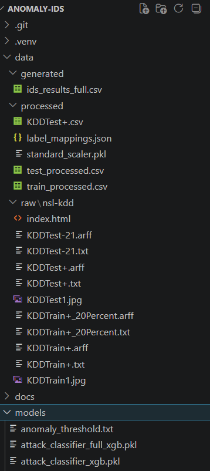
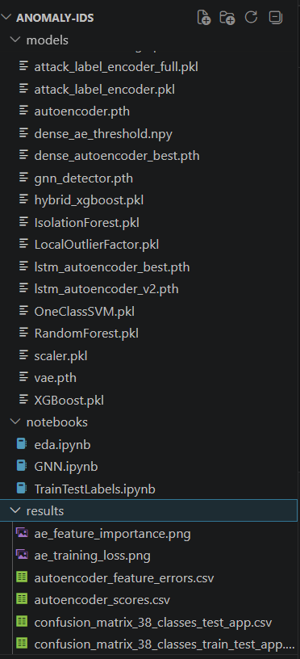
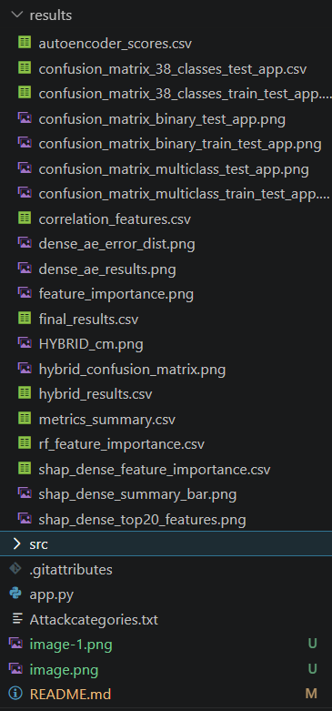
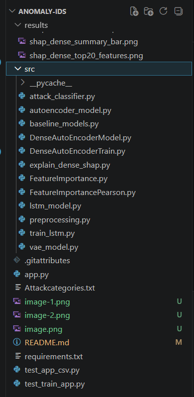
---

## Overall Folder Structure
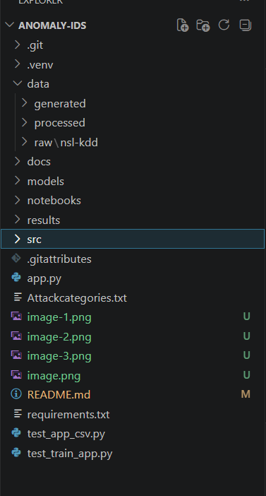

## Dataset

### NSL-KDD

The NSL-KDD dataset is an improved version of the KDD Cup 1999 dataset and is widely used for benchmarking intrusion detection systems.
URL: https://www.kaggle.com/datasets/hassan06/nslkdd

### Attack Categories

| Category | Examples |
|-----------|-----------|
| DoS | back, land, neptune, pod, smurf, teardrop |
| Probe | ipsweep, nmap, portsweep, satan |
| R2L | ftp_write, guess_passwd, imap, multihop, phf, spy, warezclient, warezmaster |
| U2R | buffer_overflow, loadmodule, perl, rootkit |

---

## Methodology

### 1. Data Preprocessing

The preprocessing pipeline performs:

- Missing value handling
- Duplicate removal
- Label encoding
- Feature scaling using StandardScaler
- Label mapping generation

Output:

```text
train_processed.csv
test_processed.csv
label_mappings.json
standard_scaler.pkl
```

---

### 2. Dense Autoencoder

The Dense Autoencoder learns normal network behaviour and identifies anomalies using reconstruction error.

Architecture:

```text
Input Layer (41 Features)
        ↓
Dense (128)
        ↓
Dense (64)
        ↓
Bottleneck (32)
        ↓
Dense (64)
        ↓
Dense (128)
        ↓
Output Layer
```

Features:

- Batch Normalization
- Dropout
- Adam Optimizer
- Learning Rate Scheduling

---

### 3. Threshold-Based Anomaly Detection

Network traffic is classified using reconstruction error:

```text
Reconstruction Error > Threshold
        ↓
Attack

Reconstruction Error ≤ Threshold
        ↓
Normal
```

The threshold is optimized experimentally using percentile analysis.

---

### 4. XGBoost Attack Classification

Detected attacks are further classified using XGBoost.

Advantages:

- High accuracy
- Fast inference
- Handles imbalanced datasets
- Robust feature selection

Output:

```text
Attack Type
↓
Neptune
Smurf
Satan
Guess_Password
...
```

---

### 5. Explainable AI (SHAP)

SHAP is used to explain:

- Global feature importance
- Local prediction explanations
- Attack-specific feature contributions

Example influential features:

- service
- flag
- num_root
- num_compromised
- num_file_creations

---

## Experimental Models

### Machine Learning

- Random Forest
- XGBoost
- Isolation Forest
- One-Class SVM
- Local Outlier Factor

### Deep Learning

- Dense Autoencoder
- Variational Autoencoder (VAE)
- LSTM Autoencoder

### Experimental

- Graph Neural Network (GNN)

---

## Results

### Model Comparision
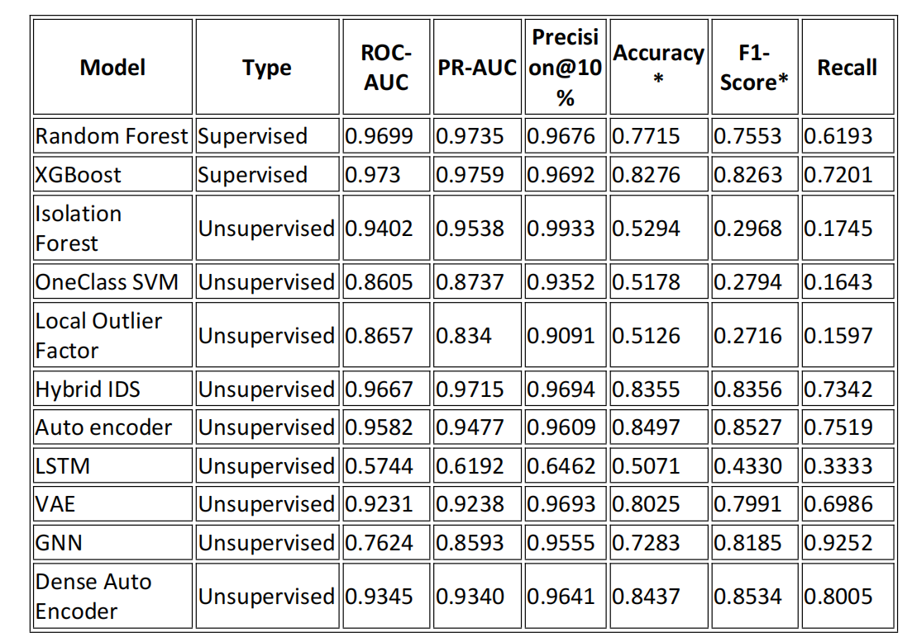

### Hybrid IDS

| Metric | Value |
|----------|----------|
| Accuracy | 91.20% |
| Precision | 89.91% |
| Recall | 92.23% |
| F1 score | 91.06% |
| ROC-AUC | 96.60% |

### Explainability

SHAP successfully identified key features responsible for anomaly detection and attack classification.

---

## Installation

### Clone Repository

```bash
git clone https://github.com/yourusername/anomaly-ids.git

cd anomaly-ids
```

### Create Virtual Environment

```bash
python -m venv venv

source venv/bin/activate
```

Windows:

```bash
venv\Scripts\activate
```

### Create and activate conda environment
```bash
 conda create -n anomaly-ids-py39 python=3.9
 conda activate anomaly-ids     
```

### Install Dependencies

```bash
pip install -r requirements.txt
```

---

## Training

### Preprocess Dataset

```bash
python src/preprocessing.py
```

### EDA
Run the eda.ipynb file. You will get the below results:
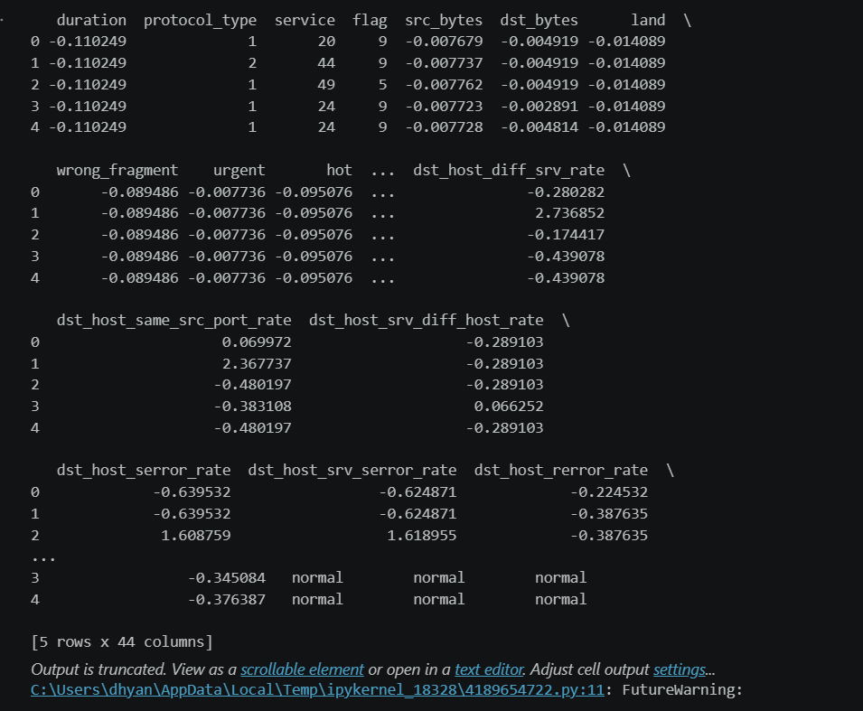
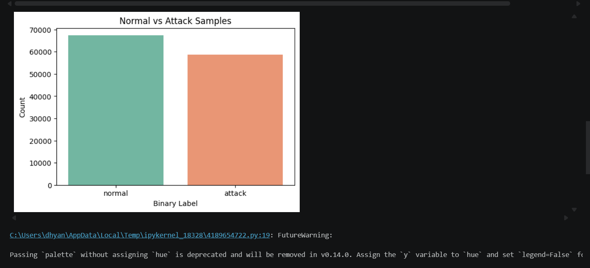
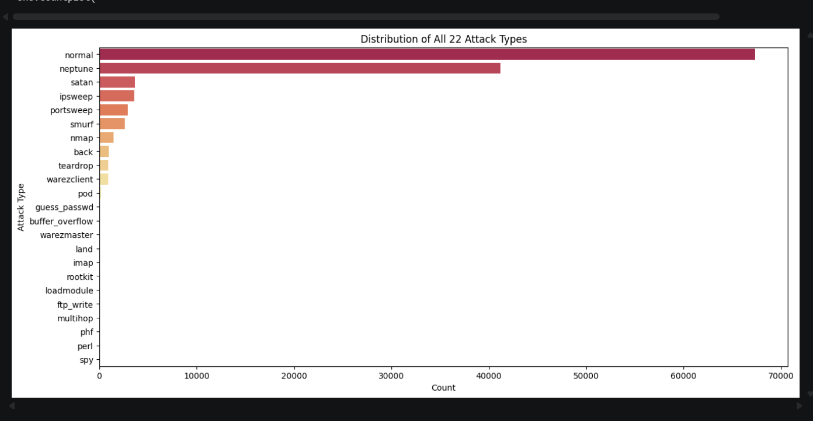
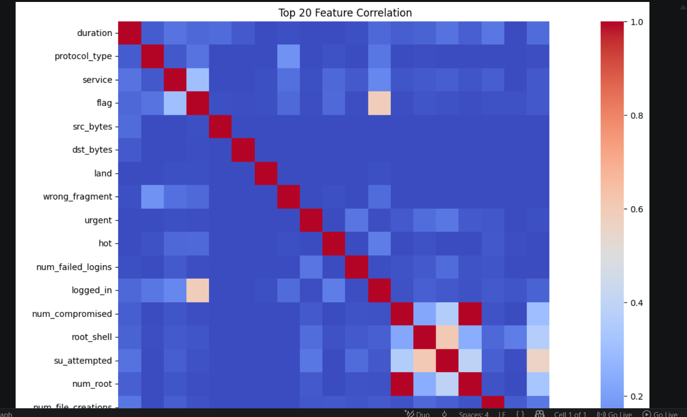

### Run supervised and unsupervised models

```bash
python src/autoencoder_model.py
```

### Train Autoencoder

```bash
python src/DenseAutoEncoderTrain.py
```

### Train LSTM

```bash
python src/lstm_model.py
python src/train_lstm.py
```

### Train VAE
```bash
python src/vae_model.py
```

### Train GNN
Run the notebooks/GNN.ipynb in the GoogleColab with help of GPU. With GPU only it will take around 15 minutes to run.

### Train Dense Autoencoder

```bash
python src/DenseAutoEncoderModel.py
python src/DenseAutoEncoderTrain.py
```

### Train XGBoost Classifier

```bash
python src/attack_classifier.py
```

### Generate SHAP Explanations

```bash
python src/explain_dense_shap.py
```

### Feature importance
```bash
python src/FeatureImportance.py
python src/FeatureImportancePearson.py
```
---

## Running the Application

Launch Streamlit:

```bash
streamlit run app.py
```

Open:

```text
http://localhost:8501
```

## UI
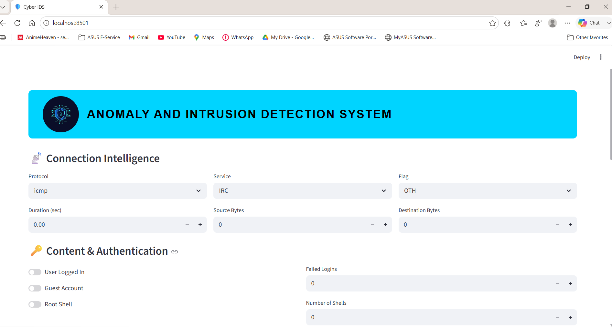
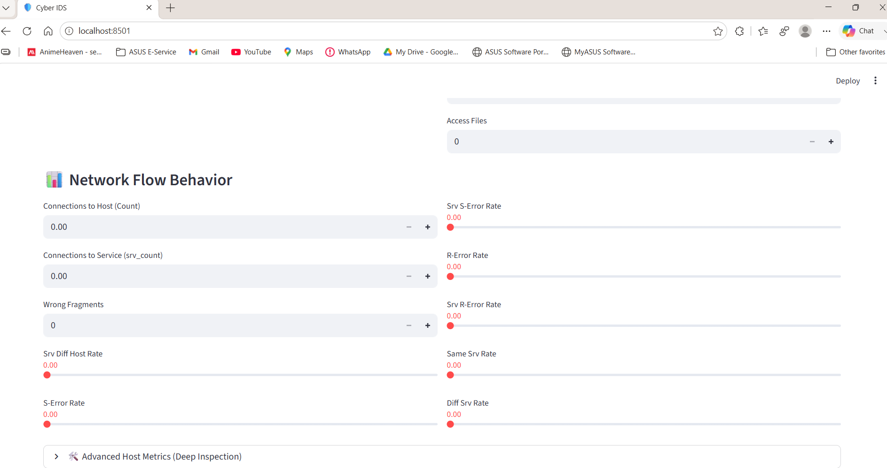
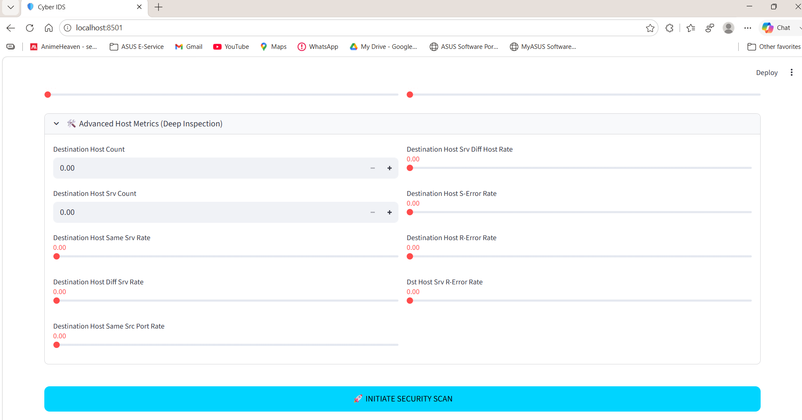
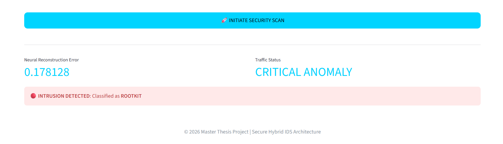

The application allows:

- Network traffic analysis
- Attack detection
- Attack classification

---

## Thesis Contributions

- Developed a hybrid IDS using Dense Autoencoder and XGBoost
- Integrated SHAP-based explainability
- Evaluated multiple ML and DL models
- Performed feature importance validation using five independent methods
- Built an interactive Streamlit-based deployment interface
- Demonstrated effective detection of anomalous network traffic

---

## Author

**Dhyaneswar Bachu**

Master's Thesis  
**Intrusion Detection Using Explainable Hybrid Deep Learning Models**

---

## License

This project is developed for academic and research purposes. Use and modify freely with proper citation.